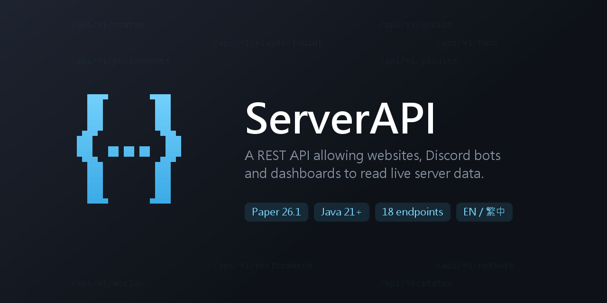

# ServerAPI

[繁體中文](README.md) · **English**

A REST API allowing websites, Discord bots and dashboards to read live data from your Minecraft server.



[](https://github.com/Kevin28576/ServerAPI/releases)
[](https://papermc.io)
[](https://adoptium.net)
[](https://modrinth.com/plugin/paper-serverapi)
[](https://jitpack.io/#Kevin28576/ServerAPI)

```bash
curl http://localhost:8080/api/v1/status
```
```json
{
  "ok": true,
  "data": { "online": ["40094f2f-…", "8b1e…"], "minecraft": 2, "discord": 3400 },
  "meta": { "version": "v1", "server": "global", "updatedAt": 1784300000000, "cachedAt": 1784299700000 }
}
```

Every player field is a **UUID**.

---

## Highlights

- **Never blocks the main thread** — data that is only safe to read on the main thread is snapshotted there on a timer; HTTP requests only ever read the cache, so traffic cannot drag down TPS
- **Per-endpoint access control** — decide which endpoints need a key, and which fields stay hidden even on public endpoints
- **Punishments kept forever** — bans, tempbans, kicks, warnings, mutes and jails remain in the history after they are lifted
- **Built-in rate limiting** — token bucket, with correct client-IP resolution behind Cloudflare or Nginx
- **No runtime dependencies** — the HTTP layer uses the JDK's built-in server and JSON is serialised in-house
- **Fully bilingual** — English and Traditional Chinese across the config, console, commands and API output

## Installation

1. Drop `ServerAPI-1.1.0.jar` into `plugins/`
2. Start the server to generate `plugins/ServerAPI/config.yml`
3. Check `http.port` — **the default 8080 often clashes with other services**
4. `curl http://localhost:8080/api/v1`

Requires Paper 26.1 and Java 21 or newer. On first start Paper's PluginLoader downloads the
database drivers (HikariCP / JDBC / Jedis) from Maven, so **the first launch needs network access**.

## Endpoints

`GET /api/v1` returns an index of every endpoint currently enabled.

| Endpoint | Returns | Key by default |
|----------|---------|:---:|
| `/status` | Online player UUIDs and count, DiscordSRV member count | |
| `/status?history=true` | Adds a time series of online and Discord counts, newest first | |
| `/player/{uuid}` | One player: name, rank, nickname, playtime, AFK, balance, Discord | |
| `/player/{uuid}?detailed=true` | Expands per-block / item / entity statistics | |
| `/server` | Version, MOTD, max players, game mode, view distance | ✓ |
| `/performance` | TPS, mean tick time, memory, JVM / OS | ✓ |
| `/worlds`, `/worlds/{name}` | World list and detail | ✓ |
| `/gamerules` | Game rules per world | ✓ |
| `/entities` | Entity counts per world, by type, players excluded | ✓ |
| `/spawnlimits` | Spawn limits and intervals per world | ✓ |
| `/punishments`, `/punishments/{uuid}` | Punishment records and statistics | ✓ |
| `/bans` | Ban list, player UUIDs and IPs | ✓ |
| `/operators` | Operator list | ✓ |
| `/whitelist` | Whitelist state and entries (off by default) | ✓ |
| `/plugins` | Installed plugin list | ✓ |
| `/placeholders?uuid=&p=` | Resolve PlaceholderAPI placeholders | ✓ |
| `/network` | Cross-server aggregation (off by default, needs multi-server + Redis) | ✓ |
| `/constants` | Static enum reference (game mode, difficulty, environment) | ✓ |

Every endpoint is served at two paths. `/api/v1/{endpoint}` is the versioned path — **use this for
integrations**. `/api/{endpoint}` is an alias that always points at the latest version.

Entity counts deliberately exclude players so they cannot leak who is online.

## Response format

```json
{ "ok": true,  "data": { … }, "meta": { … } }
{ "ok": false, "error": { "status": 404, "message": "…", "path": "…" }, "meta": { … } }
```

Branch on `ok`; the payload is always in `data`.

The two timestamps in `meta` differ:

| Field | Present on | Meaning |
|-------|-----------|---------|
| `updatedAt` | every endpoint | when this response was produced |
| `cachedAt` | snapshot endpoints | when the data was actually captured |

`updatedAt - cachedAt` is how stale the payload is. For the real age of the data, use `cachedAt`.

## Authentication

Send the key as an `X-API-Key` header, or as `?key=` when `auth.allow-query-key` is on:

```bash
curl -H "X-API-Key: <key>" http://localhost:8080/api/v1/plugins
curl "http://localhost:8080/api/v1/plugins?key=<key>"
```

> URLs end up in browser history and in reverse-proxy access logs. Use the header for real integrations.

Three layers of control:

**Per endpoint** — `auth.require-key.<endpoint>`. Anything not listed defaults to requiring a key, so
a new endpoint is never public by accident.

**Per field** — `auth.protected-fields.<endpoint>` hides individual fields even when the endpoint is
public. By default `/player` hides `op`, `banned` and `discord`: the first two are key-protected on
`/operators` and `/bans`, and leaving them exposed is a back door — read online UUIDs from the public
`/status`, then query `/player` one by one to rebuild both lists. Hidden fields are listed in
`meta.hiddenFields`.

**Disguised responses** — with `auth.hide-protected` on, unauthorised requests get a 404 rather than a
401. Answering 401 tells an attacker that something worth protecting lives there and points them at it.

> When `auth.enabled` is `false` the whole check is off and none of the above applies.
> Starting in that state logs a warning.

## Rate limiting and reverse proxies

Token bucket: credit refills at a fixed rate and short bursts are allowed, but sustained overuse
returns `429` with a `Retry-After` header. The default is 120 requests per minute per source IP with
a burst of 30.

Behind Cloudflare, Nginx or Apache every visitor appears to come from the proxy, which throws the
limiter off. Turn on `real-ip.enabled` to read the real address from proxy headers:

```yaml
real-ip:
  enabled: true
  trusted-proxies:
    - "cloudflare"        # expands to every published Cloudflare range
    - "127.0.0.1/32"
```

Proxy headers are trivially forged, so **they are only trusted when the connection itself comes from
`trusted-proxies`**. `X-Forwarded-For` is scanned right to left, skipping trusted proxies to reach the
first address that is not one.

## Punishment records

`/punishments` merges bans, IP bans, tempbans, kicks, warnings, mutes and jails, with statistics
(total, players punished, currently active).

Records are **kept permanently** — lifted or expired entries stay listed with their status changed,
which suits a public punishment lookup page. Set `punishment-log.retention-days: 0` to never purge.

Neither Minecraft nor CMI stores kick history, so this plugin listens for the events itself; that
means only kicks after it was enabled are covered.

Data comes from periodic reconciliation against the ban list and CMI rather than from intercepting
commands, so punishments are recorded no matter what issued them.

## Web pages

Three HTML pages, **all off by default**:

```yaml
web:
  docs: false           # /api/docs                 Interactive API docs and try-it
  punishments: false    # /punishments?view=html    Punishment records demo page
  placeholders: false   # /placeholders?list=true   PlaceholderAPI preview page
```

These lay the content out in full for anyone who can open them, so consider carefully before exposing
them publicly. When off, the path or parameter returns 404; the JSON endpoints are unaffected.

`/api/docs` lists every enabled endpoint and parameter, lets you fire real requests from the page, and
includes an API key field that never leaves your browser.

## Storage

History, the player stat cache and the punishment log all go to a database, which is the single source
of truth.

```yaml
storage:
  type: sqlite          # sqlite · mysql · mariadb
```

Redis is optional: reads prefer Redis, writes go to the database first and then overwrite Redis. If
Redis dies the plugin falls back to the database without interruption and backfills on reconnect.

> On a single server with a remote Redis, the local database is usually faster. Redis mainly pays off
> for cross-server aggregation.

Offline players require re-reading the stats file (~425ms measured, versus ~4ms for online players),
so only offline players are cached. Entries live in Redis or the database and use **no server memory**.

## Multi-server

Several servers can share one Redis and database, separated by `server-id`. Servers on the same
`cluster-id` discover each other, and `/network` aggregates the whole network.

```
Key       {namespace}:{cluster-id}:{server-id}:{type}[:{id}]
Single    serverapi:::history
Network   serverapi:main:survival:history
```

`server-id` defaults to `global`, meaning unset and treated as standalone. When several servers share
one Redis **each must get a unique value**, otherwise they overwrite each other's data — the plugin
warns about this at startup.

## Languages

English and Traditional Chinese are built in, covering config comments, console messages, command
replies and API output. Player-supplied text such as ban reasons and nicknames is never translated.

`language: auto` detects from the host locale and writes the result back on first start. Switch with:

```
/serverapi lang en_US
```

Switching backs up the existing config, then rebuilds it from the new language's template with
**every value preserved**. Language files live in `plugins/ServerAPI/lang/` and can be edited; keys
added in later versions are filled in automatically from the bundled copy.

## Integrations

All optional soft dependencies. When a plugin is missing its fields are `null` and nothing else breaks.

| Plugin | Provides |
|--------|----------|
| LuckPerms | `rank` on `/player` |
| CMI | nickname, colours, playtime and AFK on `/player`; warnings, mutes and jails on `/punishments` |
| Vault | `balance` on `/player` |
| DiscordSRV | `discord` on `/player`, member count on `/status` |
| PlaceholderAPI | the `/placeholders` endpoint |

`/placeholders` is the only endpoint that dispatches to the main thread, since most expansions need
Bukkit API access. It is bounded by a timeout and answers `504` if it expires.

## Commands and permissions

| Command | Description |
|---------|-------------|
| `/serverapi info` | Show current status |
| `/serverapi reload` | Reload the config and restart the HTTP server |
| `/serverapi lang <code>` | Switch language |

| Permission | Default | Description |
|------------|:-------:|-------------|
| `serverapi.admin` | op | Use the commands above |
| `serverapi.notice` | op | Receive request notifications while `debug` is on |

## Snapshot intervals

Tuned per endpoint by how fast the data changes versus what it costs to read
(`cache` in `config.yml`, in ticks):

| Endpoint | Default | Why |
|----------|---------|-----|
| `status` | 5s | Freshest and cheapest |
| `entities` | 20s | Walks every entity, the expensive one |
| `worlds` / `gamerules` / `spawnlimits` | 10m | Rarely change |

## Building

Compiling needs **JDK 25** — paper-api 26.1.2 ships Java 25 class files. The resulting jar targets
Java 21, so running it only needs Java 21 or newer.

```bash
mvn clean package
```

Output: `target/ServerAPI-1.1.0.jar`

## Licence

Free for non-commercial use; commercial servers need a separate licence. See [LICENSE](LICENSE).

Issues: [GitHub Issues](https://github.com/Kevin28576/ServerAPI/issues)
